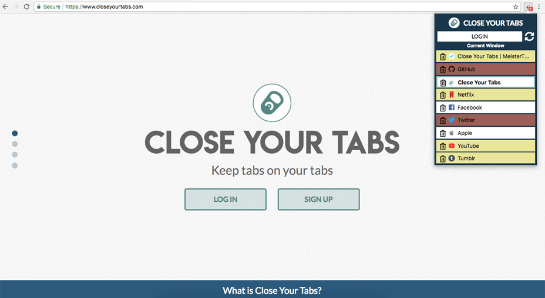
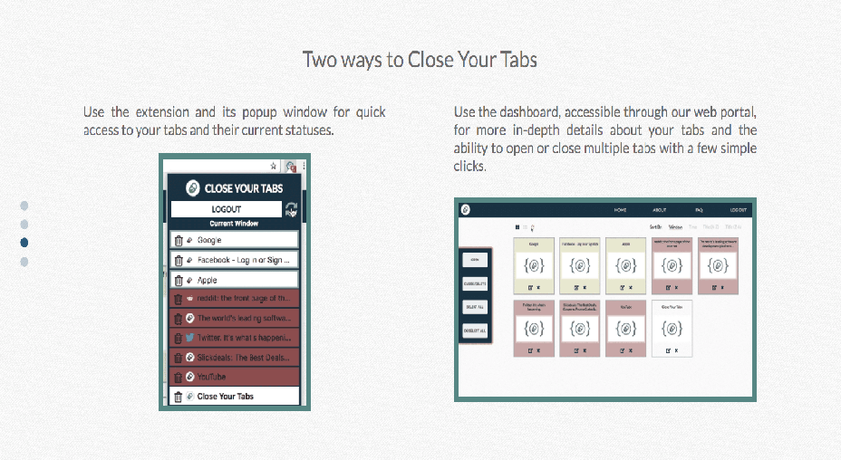
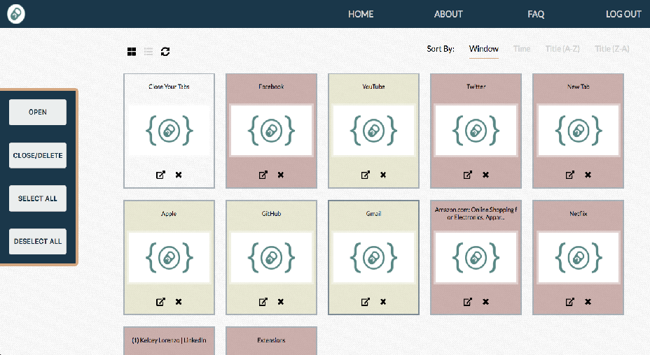
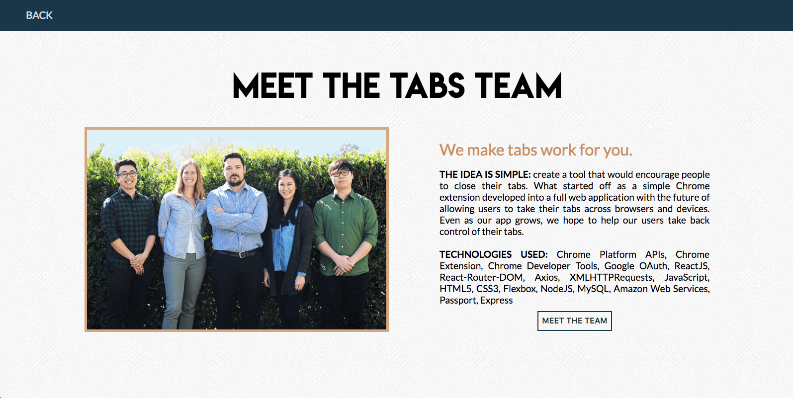

# Close Your Tabs

> Close Your Tabs seeks to organize your tabs and display usage of active and inactive tabs in order to improve your productivity. What started off as a simple Chrome Extension developed into a full web application with the future of allowing users to take their tabs across browsers and devices. Even as our app grows, we hope to help our users take back control of their tabs.

## Getting Started

> You can download the accompanying Chrome Extension [here](https://github.com/andreasandpiper/closeyourtabs-chrome-extension) and visit the accompanying web application [here](http://www.closeyourtabs.com).

## Screenshots

|  |  |
| :----------------------------------------------------------: | :-------------------------------------------------------------------: |

|  |  |
| :-------------------------------------------------------: | :--------------------------------------------------------: |

## Technologies Used

* Amazon Web Services (AWS)
* Axios 
* Chrome Platform API
* Chrome Extension 
* CSS3
* Express
* Flexbox
* Google OAuth
* HTML5
* JavaScript
* MySQL
* NodeJS
* Passport
* ReactJS
* React Router DOM

## Tools Used

* Chrome Development Tools
* Git
* GitHub
* JSDoc
* Meistertask

## Team Members

*   Andrea Wayte [GitHub](https://github.com/andreasandpiper) | [Portfolio](https://www.andreawayte.com/)
*   James Kirsch [GitHub](https://github.com/jkirsch-LF) | [Portfolio](http://jkirsch.tech/)
*   Kelcey Lorenzo [GitHub](https://github.com/m13kelore/) | [Portfolio](http://www.kelceylorenzo.com/)
*   Henry Moon [GitHub](https://github.com/HyeManMoon) | [Portfolio](http://henrymoon.net/)
*   Nick Quan [GitHub](https://github.com/nickkquan) | [Portfolio](http://nickquan.com/)

<!-- ## keys.js.template

#### googleCredentials:

*   googleClientID : From google api credentials
*   googleClientSecret : From google api credentials

#### mysqlCredentials:

*   host: IP of server hosting MySQL server
*   user: username of MySQL server user
*   password: password of MySQL server user
*   database: name of database in MySQL server -->
